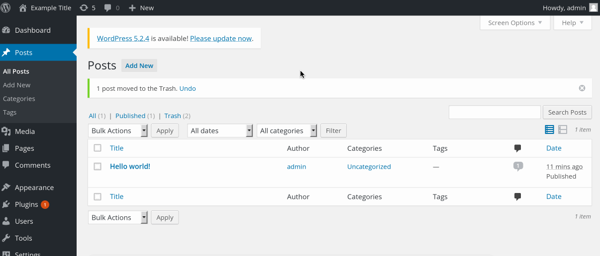
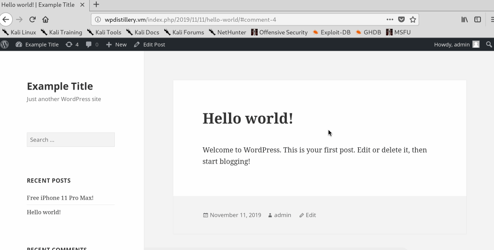
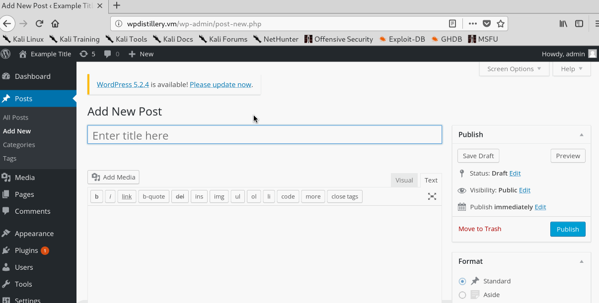

# Week 7 & 8 - WordPress Pentesting

Time spent: **5** hours spent in total

> Objective: Find, analyze, recreate, and document **five vulnerabilities** affecting an old version of WordPress

## Pentesting Report

1. 4.2.2 - Authenticated Stored Cross-Site Scripting (XSS)
    - Vulnerability types: 4.2~
    - Tested in version: 4.2
    - Fixed in version: 4.2.3
  - [x] GIF Walkthrough: 
    
  - [x] Steps to recreate: 
    1. Write any posts under author, contributor on any post.
    2. Write the following code in: `<a onmouseover= "alert('pwned - XSS Attack')" > Get your free iPhone here!</a>`
  - [x] Affected source code:
  - [x] References:
    - [Klikki.fi](https://klikki.fi/adv/wordpress3.html)

2. 3.7-4.4 Authenticated Cross-Site Scripting (XSS) CVE-2016-1564
    - Vulnerability types: 3.7 - 4.4
    - Tested in version: 4.2
    - Fixed in version: 4.2.6
  - [x] GIF Walkthrough: 
    
  - [x] Steps to recreate: 
    1. Post the following XSS code into a comment or post
    2. ` http://codepath.org/<svg onload=alert('pwned')> `
  - [x] Affected source code:
    - [Link 1](https://core.trac.wordpress.org/browser/tags/version/src/source_file.php) 
  - [x] References:
    - [CVE](https://cve.mitre.org/cgi-bin/cvename.cgi?name=CVE-2016-1564)

3. 2.5-4.6 - Authenticated Stored Cross-Site Scripting via Image Filename CVE-2016-7168
    - Vulnerability types: 2.5 - 4.6
    - Tested in version: 4.2
    - Fixed in version: 4.2.10
  - [x] GIF Walkthrough: 
    
  - [x] Steps to recreate: 
    1. Go to the internet and find an image to upload.
    2. Change the .jpg or .png with the following script `Cute-Cat.jpg`
    1. Create new media in library and upload the image.
    2. View attachment page to view the image post.
  - [x] Affected source code:
    - [Link 1](https://core.trac.wordpress.org/browser/tags/version/src/source_file.php)

4. 4.0-4.7.2 - Authenticated Stored Cross-Site Scripting (XSS) in YouTube URL Embeds CVE-2015-6535
    - Vulnerability types: 4.0 - 4.7.2
    - Tested in version: 4.2
    - Fixed in version: 4.2.13
  - [x] GIF Walkthrough: 
    
  - [x] Steps to recreate: 
    1. Create a new post and embed a link
    2. Put the following XSS code in: `[embed src='https://youtube.com/embed/pwned12312 onload=alert("pwned")'][/embed]`
  - [x] Affected source code:
    - [Link 1](https://core.trac.wordpress.org/browser/tags/version/src/source_file.php)
  - [x] References:
    - [Blog](https://blog.sucuri.net/2017/03/stored-xss-in-wordpress-core.html)
    - [CVE](https://cve.mitre.org/cgi-bin/cvename.cgi?name=CVE-2017-6817)